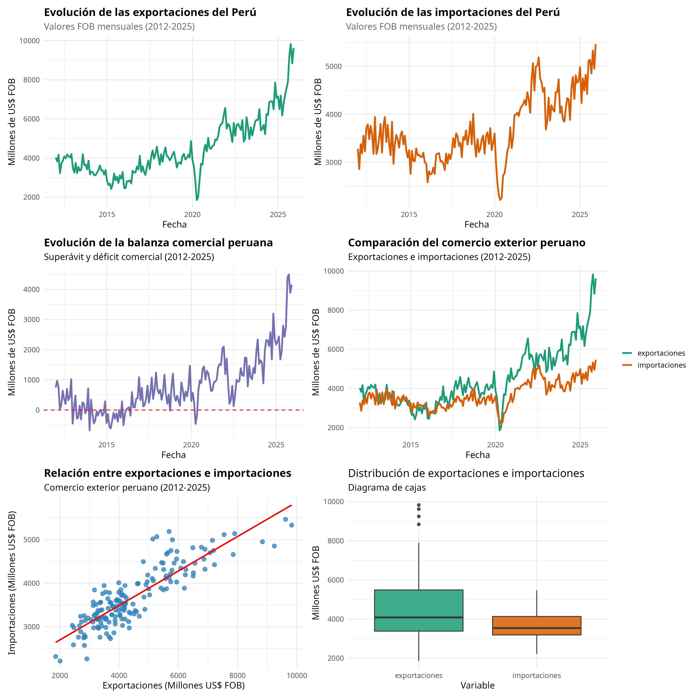

# Análisis Exploratorio de Datos (EDA): Comercio Exterior del Perú (2012-2025)

## 1. Descripción del proyecto

El presente proyecto desarrolla un Análisis Exploratorio de Datos (EDA) sobre la evolución del comercio exterior peruano durante el periodo enero de 2012 a diciembre de 2025.

El objetivo principal es analizar el comportamiento de las exportaciones, importaciones y la balanza comercial del Perú, identificando tendencias, variaciones, relaciones entre variables y posibles patrones dentro de la dinámica comercial del país.

Para ello, se aplican técnicas de limpieza, transformación, análisis estadístico descriptivo y visualización de datos utilizando el lenguaje de programación R.

## 2. Fuente de datos

Los datos utilizados fueron obtenidos del **Banco Central de Reserva del Perú (BCRP)**, institución encargada de generar y difundir información económica y estadística oficial del país.

Las bases utilizadas corresponden a:

- Exportaciones del Perú (valores FOB mensuales).
- Importaciones del Perú (valores FOB mensuales).
- Balanza comercial del Perú.

El periodo analizado comprende desde enero de 2012 hasta diciembre de 2025, obteniendo un total de 168 observaciones mensuales.

## 3. Variables analizadas

Las principales variables utilizadas en el análisis son:

| Variable | Descripción |
|----|----|
| Exportaciones | Valor mensual de las exportaciones peruanas expresado en millones de US\$ FOB. |
| Importaciones | Valor mensual de las importaciones peruanas expresado en millones de US\$ FOB. |
| Balanza comercial | Diferencia entre exportaciones e importaciones, expresada en millones de US\$ FOB. |

Además, se creó una variable adicional:

| Variable | Descripción |
|----|----|
| Tipo de saldo | Clasificación de la balanza comercial en superávit o déficit comercial. |

## 4. Procesamiento y limpieza de datos

Para preparar la información se realizaron las siguientes etapas:

- Importación de las bases de datos desde archivos Excel mediante R.
- Cambio de nombres de variables para facilitar el análisis.
- Unión de las tres bases utilizando la variable fecha.
- Transformación de la fecha desde formato texto hacia formato fecha.
- Verificación de valores faltantes.
- Creación de una variable categórica para identificar periodos con superávit o déficit comercial.

## 5. Metodología del análisis exploratorio

El análisis fue desarrollado mediante:

### Estadística descriptiva

Se calcularon indicadores como:

- Media.
- Mediana.
- Desviación estándar.
- Valores máximos y mínimos.

Estos indicadores permiten conocer el comportamiento general de las variables comerciales durante el periodo analizado.

### Análisis de correlación

Se evaluó la relación entre:

- Exportaciones.
- Importaciones.
- Balanza comercial.

Con el objetivo de identificar la asociación existente entre los principales componentes del comercio exterior peruano.

### Visualización de datos

Se elaboraron gráficos mediante la librería **ggplot2**, incluyendo:

- Evolución temporal de exportaciones.
- Evolución temporal de importaciones.
- Evolución de la balanza comercial.
- Comparación entre exportaciones e importaciones.
- Matriz de correlación.
- Histogramas de distribución.
- Diagramas de caja.
- Promedio móvil de exportaciones.

## 6. Resultados gráficos

Los principales gráficos generados se encuentran almacenados en la carpeta:figuras

Dentro de esta carpeta se incluyen las visualizaciones desarrolladas durante el análisis exploratorio, entre ellas:

- Evolución mensual de las exportaciones.
- Evolución mensual de las importaciones.
- Evolución de la balanza comercial.
- Comparación entre exportaciones e importaciones.
- Relaciones entre variables mediante gráficos de dispersión.
- Distribuciones mediante histogramas.
- Comparación de variabilidad mediante diagramas de caja.
- Tendencia de exportaciones mediante promedio móvil.

El collage de gráficos resume los principales hallazgos visuales del análisis:

A partir de las visualizaciones se observa la dinámica del comercio exterior peruano, identificando cambios en la evolución de las exportaciones, importaciones y el comportamiento de la balanza comercial durante el periodo analizado.

------------------------------------------------------------------------

## 7. Análisis final: impacto de la pandemia COVID-19

A partir de los resultados obtenidos en el análisis exploratorio inicial, se planteó la siguiente pregunta de investigación:

**¿Cómo cambió el desempeño del comercio exterior peruano antes, durante y después de la pandemia COVID-19?**

Para responder esta pregunta se dividió el periodo de estudio en tres etapas:

- Antes de pandemia (2012-2019).
- Periodo de pandemia (2020-2021).
- Después de pandemia (2022-2025).

Se calcularon indicadores promedio de exportaciones, importaciones y balanza comercial para cada periodo.

Los resultados muestran diferencias importantes entre etapas. Durante el periodo posterior a la pandemia se observa una recuperación del comercio exterior peruano, con mayores niveles promedio de exportaciones e importaciones respecto al periodo previo.

La balanza comercial también presentó una mejora después de la pandemia, evidenciando un incremento del saldo comercial favorable para el Perú.

Los principales gráficos generados en esta etapa permiten observar:

- La evolución de la balanza comercial alrededor del periodo COVID-19.
- La comparación de exportaciones promedio entre etapas.
- La evolución conjunta de exportaciones e importaciones por periodo.

## 8. Principales conclusiones

- El comercio exterior peruano presentó una alteración durante la pandemia COVID-19, reflejada en cambios en los niveles de exportaciones e importaciones.

- Después del periodo pandémico se observa una recuperación significativa del comercio exterior, alcanzando valores promedio superiores a los registrados antes de la pandemia.

- La balanza comercial mantuvo un comportamiento favorable durante gran parte del periodo analizado, con una mejora especialmente marcada después de 2021.

- Los resultados sugieren que la economía peruana logró recuperar dinamismo comercial luego del choque inicial generado por la pandemia.
